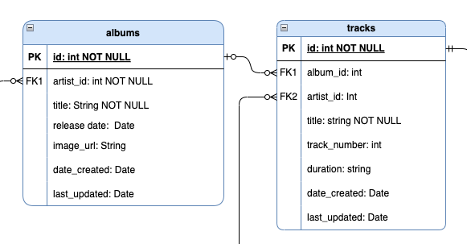

# **PesonnelAPI**

## README.md

</br>


##### _Photo by Mick Haupt (unsplash)_

</br>

### **Contents:**

1. [Quickstart](#Quickstart)
1. [Project Purpose (R1, R2)](<#Project-Purpose-(R1,-R2)>)
1. [Why PostgreSQL (R3)](<#Why-PostgreSQL-(R3)>)
1. [ORM Benefits and functionality (R4)](<#ORM-Benefits-and-functionality-(R4)>)
1. [Endpoints (R5)](<#Endpoints-(R5)>)
1. [Third Party Services (R7)](<#Third-Party-Services-(R7)>)
1. [Project Models (R8)](<#Project-Models-(R8)>)
1. [ERD and Database Relations (R6, R9)](<#ERD-and-Database-Relations-(R6,-R9)>)
1. [Project Management (R10)](<#Project-Management-(R10)>)

### **Links:**

- #### [Github Repository](https://github.com/bccbass/PersonnelAPI)
- #### [Trello Project Management](https://trello.com/invite/b/VWm2omOk/ATTI837dd0d277594dd006695995cdfdac5787BC1FFE/personnel-api)
- #### [API Endpoints](./API-Endpoints.md)

</br>

## **_Quickstart_**

1. Open a new terminal window, run PSQL and create a new PostgreSQL database entitled `personnel`:
   ```psql
   ~psql
   CREATE DATABASE personnel;
   ```
2. Connect to the new database:
   ```psql
   \c personnel
   ```
3. Create a New User, set a Password and grant all privileges:

   ```psql
   CREATE USER <user> WITH PASSWORD <password>;

   GRANT ALL PRIVILEGES ON <database_name> TO <user>;
   ```

4. In the main project directory create a `.env` file using `.env.sample` as a template.
   - The Database URI should be formatted as:  
   `Database+adapter://<user>:<password>@<host name>:<port>/<database>`  
     eg:
     
```py
  DATABASE_URI='postgresql+psycopg2://<YOUR_USER_NAME>:<YOUR_USER_PASSWORD>@localhost:5432/personnel'
  ```
   - The JWT Secret should be something secure.
     - Hint:
       generate secret code in the terminal:
     ```bash
         $ python3 -c 'import secrets; print(secrets.token_hex())'
     ```
5. You should now be able to navigate to the `src/` directory and run the bash script from the terminal to create a .venv folder, install requirements, set up the database tables and seed them with sample data:

   ```bash
   cd src/
   ``` 

   ```bash
   $ bash create_and_seed.sh
   ```

6. The database and project environments are now set up. To run the app from the terminal make sure you are in the `src/` directory and:  
   - Activate the virtual environment  

   ```bash
       $ source .venv/bin/activate 
   ```  

      - And run the program  

   ```bash  
       $ flask run
   ```  
   The server should now be running on port 8000


7. Authentication: To use the API a user must register via the `/users/register` route. The user may then login via the `/users/login` route, which will result in a JWT token being sent in a JSON response. This token is valid for 30 days and must be included in the authentication header for each HTTP request as a bearer token. After 30 days the user may simply login again to generate a new token.  

</br>

### **Project Purpose (R1, R2)**

There is currently no centralized database cataloging all the musicians that performed and contributed to recorded albums. While the information can be searched for on the internet it is usually found in disparate places with varying degrees of accuracy. Although the United States Library of Congress keeps a record of all released musical albums, the scope of their catalog falls only to the main recorded release and not the more granule details. Because the music industry has largely been driven by profit motive with little incentive to document the artistic product being created, and has often lacked self-awareness of the cultural significance of its end product, a great deal of data is either missing or hard to access from the original source material. It is only with the privilege of hindsight that the cultural importance of the contributions of the many side musicians has come into light, as is evidenced by the many books and documentaries illuminating the seldom noticed world of supporting session musicians (Muscle Shoals(2013), The Wrecking Crew(2014), countless jazz histories and biographies released over the last 50 years). The App aims to create a platform to document and store records of musical contributions in an organized and centralized database. It aspires to facilitate interactions with the information in useful and novel ways; discovering all session musicians that performed on your favorite song, or listing all of the tracks a given musician played on throughout their career. The Personnel API seeks to ameliorate the problem of a historical dearth of information regarding musicians contributions. This information is important to scholarly and cultural research as well as for its role in providing evidentiary information to aid disputes regarding financial compensation for contributing artists and their heirs. The Personnel API seeks to create a rich ecosystem for music fans and scholarly researchers alike to find information about our shared musical cultural heritage, fostering a deeper understanding and appreciation of the unsung heroes that created the magic for the music we love. 

</br>  
</br>

### **Why PostgreSQL (R3)**

PostgreSQL was chosen as the relational database management system for the Personnel API project due to its robust architecure at both small and production level scale. With over thirty-five years of support and development by an active community it has an extensive set of open source tools, libraries and frameworks. PostgreSQL supports many datatypes with appropriate validation and constraints for each, promoting data integrity and durability. Additionally, PostrgreSQL implements ACID (Atomicity, Consistency, Isolation, Durability) transactions, write-ahead logging (WAL) and point-in-time recovery. Its query language is extremely powerful with near limitless parameters for retrieving records, and supports advanced view options which can greatly improve database performance for frequent and complicated queries. Because PostgreSQL is primarily designed for SQL databases it promotes well defined relational data structures that are strongly typed, with many optional constraints and validations ensuring data integrity and robustness. Writing data in PostgreSQL is highly performant due to its implementation of multi-version concurrency control (MVCC), facilitating concurrent and frequent write operations. The Personnel API database leverages a relational model with join tables and multiple relational associations making PostgreSQL a clear frontrunner for creating and managing these associations, facilitating DQL and DML with complex interacting relationships. The web-like nature of artistic careers, sometimes spanning decades with myriad interwoven interactions pose a huge challenge to model logically, however PostgreSQL excels at managing a dataset that has a tendency towards repetition.

**Comparative drawbacks:** PostgreSQL can be more difficult to set up than other frameworks such as MySQL, posing a larger entry barrier for less experienced developers. While it has faster write speeds than MySQL it has much slower read speeds. Because PostgreSQL creates a new system process for each connected user it has much higher memory usage when multiple users are connected, allocating roughly 10mb per connected user. This poses significant resource requirements when scaling for multiple users. In comparison, MySQL uses a single system process which results in extremely efficient performance in read-heavy applications. Additionally, compared to a NoSQL DBMS PostgreSQL requires much more planning and modeling at the outset of the project, and poses more challenges to restructure the database should the scope or needs of the project change throughout production. However this issue is less specific to PostgreSQL itself and more in the realm of an SQL vs NoSQL database debate. After comparing other database options PostgreSQL remained the dbms of choice as the ample documentation, efficient write performance and functionality with regard to data integrity, validation and constraints outweighed any potential shortcomings.

</br>  
</br>  
  

### **ORM Benefits and functionality (R4)**  

 
##### ORM structure: from docs.sqlalchemy.org  


**Functionality:**
An Object Relational Mapper (ORM) acts as a layer between a database and higher level programming languages. Its main functionality is to provide object mapping between a chosen database and an object oriented programming language, allowing the user to interact with a database using high level language by leveraging the SQL Expression Language at the ORM core level. The ORM creates a paradigm shift from SQL which is an immutable and command oriented language to that of a domain-centric, Object Oriented language that is mutable and state-oriented. This functionality is aided by the implementation of transactions that are built around a session object, giving the user the ability to interact with the database in more complicated and stateful ways before committing the session to the database. ORMs allow the user to structure and define data base tables, performing all necessary DDL at the application level. Data constraints can be defined natively and relationships can be constructed, connecting related entities and conducting integrity checks. Most ORM's (either natively or through extensions such as Marshmallow) allow for functionality to convert datatypes, including between native datatypes, database datatypes and JSON. In the case of Marshmallow additional schema construction and extended data sanitization and validation offer indispensable functionality when working with user requests and server responses. 

**Benefits:** ORMs are essential to interacting with a database on the application level. They allow the developer to forego including SQL or other targeted database syntax into their code. Using higher level language to interact with a database saves time in development and creates a more streamlined and homogenous codebase. Constructing database tables can be accomplished using an Object Oriented Approach, defining constraints and allowing for easy DDL that can be updated or changed at the application level. This has the benefit of eliminating the need to incorporate SQL into the codebase or interact with a database directly. It streamlines set-up and allows for much easier restructuring of a database in development. Queries can be accomplished using more familiar syntax, excluding the need to incorporate SQL DQL within the codebase which saves production time and promotes a more understandable codebase. ORMs provide the great benefit of automatic conversion of datatypes, eliminating the need to frequently convert datatypes manually, saving time and extra code. ORMs are generally database agnostic, meaning they can be connected to many different DBMS's, granting flexibility and universality to choose the DBMS an app interacts with. Relationships and associations can be accomplished with very little effort, providing huge payoffs with functionality, eliminating the need for continually defining or querying related records. These nested records can further be configured by implementing Schemas (either natively or through extensions such as Marshmallow). Schemas can serve to filter what elements of a record are returned to a user, and allow for different schemas of the same table tailored for different scenarios. Additionally, schemas can be extremely powerful with regard to validating and sanitizing user information before committing to the database, further enhancing data integrity.

</br>  
</br>

### **Endpoints (R5)**

**_[See API-Endpoints.md](./API-Endpoints.md)_**

</br>  
</br>


### **Third Party Services (R7)**

- [**Flask-Bcrypt**](https://flask-bcrypt.readthedocs.io/en/1.0.1/)  
   Implemented for Password hashing. Bcrypt is designed to be 'de-optimized', making it much more difficult to crack with the prevalence of powerful modern hardware. Hashed passwords are then encoded using UTF-8, which is industry standard practice. 

- [**Flask**](https://flask.palletsprojects.com/en/2.3.x/)  
   Flask is a lightweight Python web framework. It is the bedrock framework of our web app, and used to create models and controllers as well as handle HTTP request/response cycles, routing and accepting and returning JSON responses to interact with the database.

- [**Flask-JWT-Extended**](https://flask-jwt-extended.readthedocs.io/en/stable/)
  Flask-JWT-Extended was implemented to create and manage JWT tokens, aiding functionality for authentication and authorization. Its primary uses are for token management and creating and authenticating bearer tokens. Flask-JWT-Extended creates a token with a header, payload and signature secret which is sent to the client in a JSON object containing the token. The user then includes this token in the HTTPS header for each request as a means authenticate and detect in-transit tampering.

- [**Flask-SQLAlchemy**](https://flask-sqlalchemy.palletsprojects.com/en/3.0.x/)  
   Implemented as an Object Relational Mapper (ORM) to interact with the PostgreSQL database. SQLAlchemy allows the user to interact with a database using native datatypes and high level language, creating seamless database integration into the project and eliminating the need to write SQL commands within the codebase. This has the advantage of saving development time and streamlining the codebase.

- [**Flask-Marshmallow**](https://flask-marshmallow.readthedocs.io/en/latest/)  
   Flask-Marshmallow was used to serialize/deserialize objects between python and the database, as well as converting python objects to JSON for HTTP responses. Schemas were implemented to construct apropriate JSON responses with targeted fields and nested objects. Flask-Marshmallow schemas were invaluable for validating and sanitizing incoming user data before committing to the database, adding additional security and data integrity. 

- [**PostgreSQL**](https://www.postgresql.org)  
   PostgreSQL was the RDBMS implemented for the API. It is a robust, open-source database with ample support and features. There are also extensive frameworks and libraries available to easily integrate it into many project environments. Its relational structure works well with the Personnel database model, handling associations with ease.

- [**Pyscopg2-binary**](https://pypi.org/project/psycopg2/)  
   Psycopg2 is a database adapter used to connect the PostgreSQL database to to the SQLAlchemy ORM. SQLAlchemy is database agnostic this adaptor is an essential component to connect it to the PostgreSQL database.

- [**Python-dotenv**](https://pypi.org/project/python-dotenv/)  
   Python-dotenv reads key-value pairs from the .env file, allowing the app to access this data through the environ module. This helps to encapsulate sensitive information, protecting the integrity of the app from malicious actors. In the Personnel API the .env file stores both the JWT secret and the database URI, both components that require security. Python-dotenv enables environment access to this file, facilitating app integrity.
   

</br>
</br>

### **Project Models (R8)**
Musical relationships between session musicians, artists and albums on which they contribute have a tendency to be labyrinthine and duplicate. When constructing a database to model these entities and relationships the implementation of normal forms and ORM relationships can help to create a data model that is logical and efficient. The use of Schemas further helps aid in connecting related models by nesting records for use in the request/response cycle. All project models have a primary key that is used as a unique identifier and can be implemented as a foreign key in related models. The naming convention is `id` for primary key and `<self-referencing-name>_id` for Foreign keys (eg. `artist_id`). Additionally all models have a `date_created` and `last_updated` attribute which are not used for forward facing functionality but reserved for potential admin and development purposes. These document date attributes are always created and updated at the application level and never by direct user input. Both date fields are assigned on record creation, and `last_updated` is re-assigned for every subsequent PUT or PATCH request. The use of `nullable=False` constraints was intentionally light handed throughout the project to allow for missing or asynchronous addition of information; this seemed necessary for such an organic dataset.   

**Artists:**  
As the Database structure is mostly hierarchical (with the exception of an additional direct relationship between tracks and artists), the root of the structure is the Artist Model. The Artist model stores information relating to a recording artist or entity (Individual artists, bands or ensembles) and is represented as the table `artists` in the database. The information for Artists in this context is purposefully light, as its role is for creating associations more than it is for storing information. This approach was taken as the focus of the App is on contributing session musicians, and in most cases ample information can be found about recording artists via resources like AllMusic or Discogs.  It fields are `name` (string, required) and `albums`, which is associated with the Album model.  Artists have a one-to-many relationship between themselves and the albums they have released. Artists are associated with albums by the inclusion of the `artist_id` foreign key attribute in the `Album` model. This relationship is defined in the SQLAlchemy Model `Artist` with `db.relationship()`, which also functions to back populate the `artist` field in `Albums`. By defining `albums` in the Marshmallow schema `ArtistSchema` using `fields.List()` a nested list of all of the album objects associated with the artist is then connected to the artist, making displaying meaningful information automatic without additional queries or logic. 

**Albums:**  
The Album model is comprised of information related to each release by an artist and corresponds to the table `albums` on the database. It has a required field for `title` (string) as well as fields for `release_date` (date object) and `img_url` (string/URL).The field `artist_id` (foreign key) has cascade-delete functionality so if an artist is deleted all associated albums will also be deleted. The Album model has fields for relationships with `artist` (associated by its foreign key `artist_id`) and `tracks` (associated by the foreign key `album_id` on the Track model). The `artist` field back populates `albums` on the Artist model, and the `tracks` field back populates `album` on the Track model. These relationships form the reciprocal associations between these interconnecting objects. The relationships are also modeled in the AlbumSchema for further functionality.  
**Tracks:**
The Track model represents a single song and corresponds to to the `tracks` table on the database. It has two foreign keys, `artist_id` and `album_id` to establish ownership by an artist and an association with an album. Other fields are `title` (string, not null) for song name, `track_number` (integer) for song position on album and `duration` (string). The Track model has three relationship associations: 
- `musicians`: A list of musicians who played on the track. This field is connected to the Track model via the secondary join table `track_musician`, and back references the `tracks` field on the Musician model. This join table is essential to establishing this many-to-many relationship within normal form conventions. 
- `album`: Uses the `album_id` foreign key to associate the album that the track appears on. This field back populates the `tracks` field on the Album model, creating a list of all tracks that have that albums Primary Key as their `album_id` foreign key.
- `artist`:  Uses the `artist_id` foreign key to associate the track with the artist who released it.  

**Track_Musician:**  
Track_musician is the model for the association table used to create the many-to-many relationship between tracks and musicians within the boundaries of normalization. It corresponds to the track_musician table on the database. Besides the universal fields it is only comprised of two required foreign key fields to store the primary keys for a given musician and a track. This record serves to credit a musician with their contribution to a song. As such, it corresponds to the `/credit` route. This table is the conduit for this credit and creates a reciprocal association by being named as a secondary table in the `musicians` field on the `Track` Model. The ORM will also associate that track with its corresponding musicians.

**Musician:**  
The Musician model is used to represent all session musicians that have performed on a track. It corresponds to the `musicians` table on the database. It has fields for first name and last name, with only the first name being required (allowing for single-named musicians). It has a foreign key field for instrument_id to associate the musician with their main instrument and keep the database normalized. It has two fields for birth and death dates that both have data constraints, entered in `year-month-day` format and a field for image url. A relationship between the musicians and their instrument is established in the field `instrument`. This field does not cascade delete as the instrument should remain in the database even if the artist record is removed.  
**Instrument:**  
The Instrument model is used to store a table of instruments that can be associated with a musician. It is intended to be a fully diverse set of instruments and remain in a largely static state, acting more like a tag than a dynamic entity. As such the routes for `/instruments` are limited to only one read only list of all instruments. The Instrument model consists of one main field for name (string, not null).  
**User:**   
The User model is mainly used to store users to manage authentication and authorization. It is made of fields:
- `name` - The name of the user, used mostly for descriptive purposes
- `email` - Required email-type data. This field must be unique, so it is well suited to being the identifier for logins and is essential for authentication. 
- `password` - A string that is between 8 and 20 characters long, which is hashed with Bcrypt and encoded to UTF-8 before being stored in the database, as is industry standard practice.
- `is_admin` - This is used for authorization, is a boolean and automatically set to false on registration. It is only alterable by other admins via the `/users/grant_admin_access` endpoint.  
The user model has no relationship with any other model. This was a choice as the database aims to store historical records as opposed to user content. The API is structured to be only read-only from the user end, with creating, updating and deleting only allowed by admins/devs, making the User model essential for separating roles with different privileges. 
 
</br>
</br>

### **ERD and Database Relations (R6, R9)**

  
##### *Figure 8-1*

Modeling the complex and weblike interactions of session musicians and the recordings to which they have contributed over careers that often span decades posed many unique challenges. It required a great deal of consideration to construct a database structure that was logical and normalized but allowed room for the organic and serpentine nature of the data being recorded. An ERD was constructed in a hierarchical manner, nesting each progressive entity via a primary/foreign key relationship (Figure 8-1). There was one many-to-many relationship tracked, joining musicians who performed on a song with the many songs they contributed to. The spirit of the hierarchy is: artists _have_ albums _that have_ tracks _that have_ musicians _who are associated with an_ instrument. There is also a user entity to track end-users and admins that interact with with the database. This model is essential to implementing authentication and authorization. 

- Artist:  
   
   ##### *Figure 8-2*  
   
  The artist model stores the artist, ensemble or band that an album is recorded by (Figure 8-2). As the scope of the API is primarily focused on the session musicians involved, and general information about most recording artists is readily available, this model is light on extra data. It should be noted that session musicians can also be artists, and in this instance they would be separate entities as the roles of artist and musician are purposefully bifurcated for this context. This can be seen in the case of `"Davis, Miles"` the artist and `"Miles Davis"` the trumpeter. The artist model is an entity with ownership of a recorded album (think of bands, ensembles, symphony orchestras), so in this instance there is an implicit role coercion of a musician who has released albums under their own name to an artist entity. This was necessary as can be seen by examining the converse scenario: Nirvana or the New York Philharmonic could not be classified as musicians within this database model.

- Album:  
    
   ##### *Figure 8-3*

  Albums are associated with artists in a one-to-many relationship. An artist can have many albums but an album can have only one artist. The album model is a store for an associated artists primary key, the album title, release date, and other data that might be useful in filtering and constructing queries in meaningful ways. An albums primary key serves as the foreign key for tracks(songs), forming a one-to-many relationship and associated the album with the track(see Figure 8-3).
- Track:  
 
   ##### *Figure 8-4*
   
   Tracks are related to artists in a one to many relationship (see Figure 8-4): A track can have one artist, but an artist can have many tracks; the artist_id field on the tracks model creates this foreign-key relationship. The second foreign key for the track model is album_id; an album can have many tracks, but a track is only on one album. Tracking artists and albums seperately, as opposed to letting the hierarchical nesting take care of these associations, was necessary to cover the use-case of compilation albums where the album may be under one artists name but be comprised of tracks from multiple artists (e.g. Jimmy Cliff _The Harder They Come Sountrack_). Another scenario is that of tracks that are not released on albums: To allow for this use-case tracks are not obligated to be associated with an album but can still have an artist. Again, depending on the nested hierarchy to populate artist data breaks down in this scenario (An increasingly common use-case with so many artists self releasing single tracks on platforms like Soundcloud or Spotify).
- Track_musician:  
  The track_musician model (Figure 8-4) serves as the association table to bridge the many-to-many relationship between tracks and the session musicians who contributed to the track. As this relationship comprises the core mission statement of the Personnel API it is the lynchpin of the entire database structure. Each track_musician record associates a given session musician with a track to which they contributed: if a track has 6 musicians playing on it, it will require 6 track_musician records to join these associations within the database. The two main keys on the track_musician model store the primary key associated with a track and a musician to form this join relationship.

- Musician:  
  The musician model (Figure 8-4) has a one to one relationship with the track_musician model and also with the instrument model. It stores a large amount of information relating to each session musician in an effort to create a more robust and realistic data record. This model includes birth and death dates, image url, full name and associated instrument. The nested structure allows for schema inclusions of every track a musician has been associated with, giving a full picture of a musicians career, life and artistic contributions.

- Instrument:  
    
   ##### *Figure 8-5*

  The instrument model (Figure 8-5) serves to store the instruments associated with musicians. Although it is a relatively simple table in its current state, it is imperative to keeping the database normalized. The instrument association works like a 'tag' to associate an instrument to a musician. In the future, this feature could be stretched to a many-to-many relationship; many musicians play multiple instruments. Although this would be a more lifelike data model, for the scope of this project a many-to-one relationship was a necessary accommodation.

- User:  
    
   ##### *Figure 8-6*

  Finally, the user model (Figure 8-6) serves primarily to implement authentication and authorization. As the API seeks to create a historical record of a facet of the recording industry, creating user-ownership over records was not necessary. However, as the API is structured for the public facing side to be primarily read only, with the collection and writing of data falling to developers or administrators, the user model is crucial in defining and enforcing those roles. User name is used to give user a personalized identity and an email address is used as a unique identifier that is required for logins and useful for correspondence and identification. The required password is a string that is between 8 and 20 characters long, which is hashed and encoded to UTF-8 before being stored in the database.  
  </br>
  </br>

### **Project Management (R10)**  

Project management and planning are imperative for productive and streamlined software development. By laying out the projects requirements and the steps needed to meet those requirements implementation becomes more manageable and efficient. In planning for the Personnel API many elements from AGILE development were incorporated, including user stories, daily stand ups, features and sprints to complete the features. In addition to creating an accurate ERD early in development, [Trello](https://trello.com/invite/b/VWm2omOk/) was used heavily to plan and track the projects development. Trello is a project management web app that excels at tracking numerous tasks, with extended functionality for dates/deadlines as well as team collaboration. Its design is perfectly suited to facilitate Agile project development. Before beginning the project the trello board was populated with cards for In-progress tasks, To Do tasks, Features and Completed tasks. Mid-development cards for bugs and for fixed-bugs were implemented to track smaller issues that needed attention.


##### Earlier stages of development 6/25/2023  
  

</br>

  
##### Current stages of development as of 6/30/2023  

 Deadlines were set and associated with tasks to ensure the project stayed on course, within scope and would be delivered within the assigned timeframe. Each task and feature was given a due date, which was conceived by considering the work flow needed for development and estimating the necessary amount of time required. Labels were also created and implemented to help organize tasks and associate them with specific categories.   
  
 ##### examples of labels and due dates in project management  


Features were defined in early stages of development and were completed in sprints, checking off completed list items until the feature requirements were met:


As the scope of models to create basic CRUD operations was numerous, an entire CRUD feature list was implemented and invaluable to ensure all basic endpoints would be available:


User stories were an invaluable tool to help guide the features and endpoints to be included in the project. They provided real world use cases from a variety of user perspectives adding depth and meaning to the projects stated goals.  

  

Not only were user stories used to guide the spirit of the project, they were also implemented as descriptive endpoint destinations for the API:  

  


Daily stand ups aided by the Coder Academy Discord Server were helpful in defining accomplishments, challenges and setting goals for the next daily iteration. These stand ups were instrumental in framing each 24 hour period, providing reflection and perspective as well as direction for the next iteration.
 


</br>
</br>

