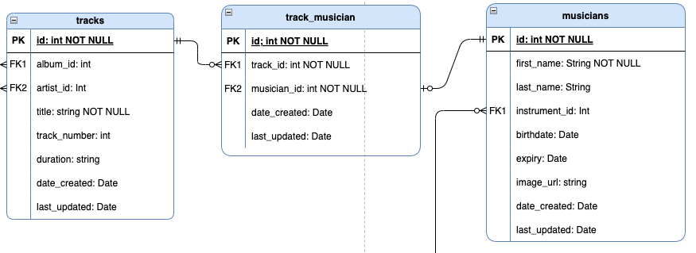
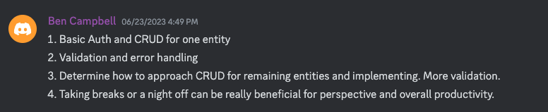

# **PesonnelAPI**

## README.md

</br>


##### _Photo by Mick Haupt (unsplash)_

</br>

### **Contents:**

1. [Quickstart](#Quickstart)
1. [Project Purpose (R1, R2)](<#Project-Purpose-(R1,-R2)>)
1. [Why PostgreSQL (R3)](<#Why-PostgreSQL-(R3)>)
1. [ORM Benefits and functionality (R4)](<#ORM-Benefits-and-functionality-(R4)>)
1. [Endpoints (R5)](<#Endpoints-(R5)>)
1. [Third Party Services (R7)](<#Third-Party-Services-(R7)>)
1. [Project Models (R8)](<#Project-Models-(R8)>)
1. [Database Relations (R6, R9)](<#ERD-and-Database-Relations-(R6,-R9)>)
1. [Project Management (R10)](<#Project-Management-(R10)>)

### **Links:**

- #### [Github Repository](https://github.com/bccbass/PersonnelAPI)
- #### [Trello Project Management](https://trello.com/invite/b/VWm2omOk/ATTI837dd0d277594dd006695995cdfdac5787BC1FFE/personnel-api)
- #### [API Endpoints](./API-Endpoints.md)

</br>

## **_Quickstart_**

1. Open a new terminal window, run PSQL and create a new PostgreSQL database entitled `personnel`:
   ```psql
   ~psql
   CREATE DATABASE personnel;
   ```
2. Connect to the new database:
   ```psql
   \c personnel
   ```
3. Create a New User, set a Password and grant all privileges:

   ```psql
   CREATE USER <user> WITH PASSWORD <password>;

   GRANT ALL PRIVILEGES ON <database_name> TO <user>;
   ```

4. In the main project directory create a `.env` file using `.env.sample` as a template.
   - The Database URI should be formatted as:  
   `Database+adapter://<user>:<password>@<host name>:<port>/<database>`  
     eg:
     
```py
  DATABASE_URI='postgresql+psycopg2://<YOUR_USER_NAME>:<YOUR_USER_PASSWORD>@localhost:5432/personnel'
  ```
   - The JWT Secret sould be something secure.
     - Hint:
       generate secret code in the terminal:
     ```bash
         $ python3 -c 'import secrets; print(secrets.token_hex())'
     ```
5. You should now be able to run the bash script from the terminal to create a .venv folder, install requirements, set up the database tables and seed them with sample date:

   ```bash
   $ bash create_and_seed.sh
   ```

6. The database and project environments are now set up. To run the app from the terminal:  
 activate the virtual environment:  

   ```bash
       $ source .venv/bin/activate 
   ```  

   and run the program:  

   ```bash  
       $ flask run
   ```  


7. Authentication: To use the API a user must register via the `/users/register` route. The user may then login via the `/users/login` route, which will result in a JWT token being sent in a JSON respone. This token is valid for 30 days and must be included in the authentication header for each HTTP request as a bearer token. After 30 days the user may simply login again to generate a new token.  

</br>

### **Project Purpose (R1, R2)**

There is currently no centralized database cataloging all the musicians that performed and contributed to recorded albums. While the information can be searched for on the internet it is usually found in disparate places with varying degrees of accuracy. Because the music industry has largely been driven by profit motive with little incentive to document the artistic product being created a great deal of data is either missing or hard to access. It is only with the privilege of hindsight that the cultaral importance of the contributions of the many side musicians has come into light, as can be seen with many books and documentaries(Muscle Shoals(2013), The Wrecking Crew(2014)) illuminating the seledom visited world of supporting session musicians. The App creates a platform to document musical contributions and query the information in many ways, such as discovering all session musicians that peformed on your favorite song, or listing all of the tracks a given musician played on. The Personnel API seeks to address to the problem of a historical lack of addredidation of musical contributions, important to scholarly and cultural research as well as for its role in providing financial compensation for contributing artists and their heirs. The Personnel API seeks to create a rich ecosystem for music fans and scholarly researchers alike to find information about our musical cultural heritage.

</br>  
</br>

### **Why PostgreSQL (R3)**

PostgreSQL was used for the Personnel API project because it is an extremely robust relational database management system that excels at both small and production level scale. It has over thirty-five years of support and development by an active community with an extensive set of open source tools, libraries and frameworks. PostgreSQL supports many datatypes with approprate validation and constraints for each. PostgerSQL is adept at promoting data integrity and durability, always implementing ACID (Atomicity, Consistency, Isolation, Durability) transactions, write-ahead logging (WAL) and point-in-time recovery. PostgreSQL query language is extremely powerful with near limitless parameters for retrieving records. It also supports advanced view options which can greatly improve database performance for frequent and complicated queries. Because PostgreSQL is primarily designed for SQL databases it promotes well defined relational data structures that are strongly typed, with many optional constraints and validations ensuring data integrity and robustness. Writing data in PostgreSQL is highly performant due to its implementation of multiversion concurrency control (MVCC), faciliating concurrent and frequent write operations. The Personnel API database leverages a relational model with join tables and multiple relational associations making PostgreSQL a clear frontrunner for creating and managing these associations, facilitating querying and manipulating data with complex interacting relationships. The web-like nature of artistic careers, sometimes spanning decades with myriad interwoven interactions pose a huge challenge to model logically, however PostgreSQL excels at managing a dataset that has a tendency towards repetition. Normalization results in a database with no redundant data, promoting data integrity and conservation of resources with regard to both data storage and performance.

Some drawbacks of PostgreSQL compared to other Database Management Systems: It can be more difficult to set up than other frameworks such as MySQL, posing a larger entry barrier for less experienced developers. While it has faster write speeds than MySQL it has much slower read speeds. Because PostgreSQL creates a new system process for each connected user it has much higher memory usage when multiple users are connected, allocating roughly 10mb per connected user. This poses significant resource requirements when scaling for multiple users. In comparison, MySQL uses a single system process which results in extremely efficient perforamance in read-heavy applications. Additionally, compared to a NoSQL DBMS PostgreSQL requires much more planning and modelling at the outset of the project, and poses more challenges to restructure the database should the scope or needs of the project change throughout production. However this issue is less specific to PostgreSQL itself and more in the scope of an SQL vs NoSQL database debate. After comparing other database options PostgreSQL remained the dbms of choice as the ample documentation, efficient write performance and functionality with regard to data integrity, validation and constraints outweighed any potential shortcomings.

</br>  
</br>  
  

### **ORM Benefits and functionality (R4)**  

**Functionality:**
An Object Relational Mapper (ORM) acts as a layer between a databse and higher level programming languages and framewords such as Python and Flask. Its main functinality is to provide mapping between a chosen database and an object oriented prgramming language, allowing the user to interact with a database using high level language, mapping native datatypes to database tables and records (and vice-versa) effortlessly. The user can implement the full range of CRUD operations within the database in a familiar language, versus incorporating SQL syntax and commands within their code; the ORM then translates these directives into SQL in order to interact with the database more seamlessly. Additionally, querying can be accomplished using more familiar syntax, excluding the need to incorporate SQL queries within the codebase. ORMs also provide functionality to construct and manage relationships and associations, automatically connecting related entities and performing integrity checks, such as those relating to foreign key constraints, without having to manually ensure integrity is enforced. ORMs are generally database agnostic, meaning they can be connected to many different DBMS's, granting flexiblity and universality to choosing the database an app interacts with. Most ORM's (either nativley or through extensions such as Marshmallow for Flask) allow for functionality to convert datatypes, including between native datatypes, database datatypes and JSON. In the case of Flask-Marshmallow, addtional schema construction and extended data sanitisaztion and validation offer indispensiple functionality. Lastly, the ORM allows for creating and constructing transactions by using a session object, giving the user the ability to interact with the database in more complicated and sequential ways before making changes to the database by commiting the constructed session object.

**Benefits:** ORMs are essential to interacting with databases on the application level. They allow the developer to forego including SQL or other targeted database syntax into their code. Using higher level language to interact with a database saves time in development and creates a more streamlined codebase. Constructing databases tables can be accomplished using an Object Oriented Approach, definining constraints and allowing for easy DDL that can be updated or changed at the application level. Querying can also be accomplished with language more familiar to the high level programming language, foregoing the need to include and implement a more specified database language such as SQL. ORMs provide a great deal of functionality with conversion of datatypes, allowing for datatypes to be converted between queries and commits without much hassle, eliminating the need to frequently convert datatypes manually. Relationships and associations can be accomplished with very little effort, providing huge payoffs with functionality, eliminating the need for continally defining or querying related records. These nested records can further be configured by implementing Schemas (either natively or through extensions such as Marshmallow). Schemas are also a great way to control what elements of a record are returned to a user, and allow the developer to create different schemas for the same table to apply to different scenarios. Additionally, schemas can be extremely powerful with regard to validating and sanitizing user information before commiting to the database, further enhancing data integrity.

</br>  
</br>

### **Endpoints (R5)**

**_[See API-Endpoints.md](./API-Endpoints.md)_**

</br>  
</br>


### **Third Party Services (R7)**

- [**Flask-Bcrypt**](https://flask-bcrypt.readthedocs.io/en/1.0.1/)  
   Implemented for Password hashing. Bcrypt is designed to be 'de-optimized', making it much more difficult to crack with the prevalence of powerful modern hardware. Hashed passwords are then encoded using UTF-8, which is industry standard practice. 

- [**Flask**](https://flask.palletsprojects.com/en/2.3.x/)  
   Flask is a lightweight Python web framework and is the main frameword our app is created in, helping to create models and controllers for the API. It is implemented primarily to handle HTTP request/response cycles, routing, accepting user data in the form of JSON to write to the database, ands serving JSON responses constructed from database records.

- [**Flask-JWT-Extended**](https://flask-jwt-extended.readthedocs.io/en/stable/)
  JWT was implemented to create and manage JWT tokens, aiding functionality for authentication and authorization. Its primary uses are for token managemnt, creating and authenticating bearer tokens. Flask-JWT-Extended creates a token with a header, payload and signature secret which is sent to the client by an http response as a JSON that includes the token as a string. The user then includes this token in the HTTPS header for each request to authenticate and detect in-transit tampering.

- [**Flask-SQLAlchemy**](https://flask-sqlalchemy.palletsprojects.com/en/3.0.x/)  
   Implemented as an Object Relational Mapper (ORM) to interact with the PostgreSQL database. SQLAlchemy allows the user to interact with a database using native datatypes and high level language, creating seamless database integration into the project and eliminating the need to write SQL commands within the codebase. This has the advantage of saving development time and streamlining the codebase.

- [**Flask-Marshmallow**](https://flask-marshmallow.readthedocs.io/en/latest/)  
   Flask-Marshmallow was used to serialize/deserialize objects between python and the database, as well as converting python objects to JSON for HTTP responses. It is used to construct schemas which aid in controlling what data from a record is served to the user in any given JSON response. Flask-Marshmallow is also invaluable for validating and sanitizing incoming user data before it is commited to the database, adding additional security and data integrity. 

- [**PostgreSQL**](https://www.postgresql.org)  
   PostgreSQL was the RDBMS implemented for the API. It is a robust, open-source database with great support and features. There are also extensive frameworks and libraries available to easily integrate it into many project environments. Its relational structure works well with the Personnel database model, handling associations with ease.

- [**Pyscopg2-binary**](https://pypi.org/project/psycopg2/)  
   SQLAlchemy is database agnostic so an adaptor must be implemented as a utility to connect it to the PostgreSQL database.

- [**Python-dotenv**](https://pypi.org/project/python-dotenv/)  
   Python-dotenv reads key-value pairs from the .env file, allowing the app to access this data through the environ module. This helps to encapsulate sensitive information, protecting the integrity of the app from malicious actors.

</br>
</br>

### **Project Models (R8)**

FLASK
</br>
</br>

### **ERD and Database Relations (R6, R9)**


Modelling the complex and weblike interactions of session musicians and the recordings to which they have contributed over careers that often span decades poses many unique challenges. It required a great deal of consideration to construct a database structure that was logical and normalized but allowed room for the organic and serpentine nature of the data being recorded. The models were constructed in a hierarchical manner, nesting each progressive entity via a primary/foreign key relationship. There was one many-to-many relationship tracked, joining musicians who performed on a song with the many songs they contributed to. The spirit of the hierarchy is: artists _have_ albums _that have_ tracks _that have_ musicians _who are associated with an_ instrument.

- Artist:  
    
  The artist model stores the artist, ensemble or band that an album is recorded by. As the scope of the API is primarily focused on the session musicians involved, and general information about most recording artists is readly available, this model is light on extra data. It should be noted that session musicans can also be artists, and in this instance they would be seperate entities as the roles of artist and musician are purposefully bifurcated for this context. This can be seen in the case of `"Davis, Miles"` the artist and `"Miles Davis"` the trumpeter. The artist model is an entity with ownership of a recorded album (think of bands, ensembles, symphony orchestras), so in this instance there is an implicit role coercion of a musician who has released albums under their own name to an artist entity. This was necessary as can be seen by examining the converse scenario: Nirvana or the New York Philharmonic could not be classified as musicians within this database model.

- Album:  
    
  Albums are associated with artists in a one-to-many relationship. An artist can have many albums but an album can have only one artist. The album model is a store for an associated artists primary key, the album title, release date, and other data that might be useful in filtering and constructing queries in meaningful ways.
- Track:  
    
  Tracks are related to artists in a one to many relationship: A track can have one artist, but an artist can have many tracks, so artist_id is a foreign key. The second foreign key for the track model is album_id; an album can have many tracks, but a track is only on one album. Explicitly tracking these associated models (artists and albums), as opposed to letting the hierarchaical nesting take care of these associations was necessary to cover the use-case of compilation albums where the album may be under one artists name but be comprised of tracks from multiple artists (e.g. Jimmy Cliff _The Harder They Come Sountrack_). Furthermore, tracks are not obligated to be associated with an album but can still have an artist, so depending on this hierarchy to populate artist data breaks down in this scenario (An increasingly common use-case since so many artists are self releasing singles on platforms like soundcloud or Spotify which are not associated with albums).
- Track_musician:  
    
  The track_musician model serves as the association table to bridge the many-to-many relationship between tracks and the session musicians who contributed to the track. As this relationship comprises the core mission statement of the Personnel API it is the lynchpin of the entire database structure. Each track_musician record associates a given session musician with a track to which they contributed: if a track has 6 musicians playing on it, it will require 6 track_musician records to join these associations within the database. The two main keys on the track_musician model store the primary key associated with a track and a musician to form this join relationship.

- Musician:  
    
  The musician model has a one to one relationship with the track_musician model and also with the instrument model. It stores a larger amount of personal information relating to each session musician, including birth and death dates, img url, full name and associated instrument.

- Instrument:  
    
  The instrument model serves to store the instruments associated with musicians. Although it is a relatively simple table in its current state, it is imperative to keeping the database normalized. The instrument association works like a 'tag' to associate an instrument to a musician. In the future, this feature could be stretched to a many-to-many relationship; many musicians play multiple instruments. Although this would be a more lifelike data model, for the scope of this project a many-to-one relationship was a necessary accomodation.

- User:  
    
  Finally, the user model serves primarily to implement authentication and authorization. As the API seeks to create a historical record of a facet of the recording industry, creating user-ownership over records did not seem necessary. However, as the API is structured for the public facing side to be primarily read only, with the collection and writing of data falling to devs or administrators, the user model is crucial in defining and enforcing those roles.
  </br>
  </br>

### **Project Management (R10)**  

Project management and planning are imperative for productive and stream lined software development. By laying out the projects requirements and the steps needed to meet those requirements implementation becomes more manageable and efficient. In planning for the Personnel API many elements from AGILE development were incorporated, including user stories, daily standups, features and sprints to complete the features. In addition to creating an accurate ERD early in development, [Trello](https://trello.com/invite/b/VWm2omOk/) was used heavily to plan and track the projects development. Trello is a project management web app that excels at tracking numerous tasks, with extended functionality for dates/deadlines as well as team collaboration. It's design is perfectly suited to facilitate Agile project development. Before beginning the project the trello board was populated with cards for In-progress tasks, To Do tasks, Features and Completed tasks. Mid-development cards for bugs and for fixed-bugs were implemented to track smaller issues that needed attention.


##### Earlier stages of development 6/25/2023  
  

</br>

  
##### Current stages of development as of 6/30/2023  

 Deadlines were set and associated with tasks to ensure the project stayed on course, within scope and would be delivered within the assigned timeframe. Each task and feature was given a due date, which was conceived by considering the work flow needed for development and estimating the necessary amount of time required. Labels were also created and implemented to help organize tasks and associate them with specific role. 
  
 ##### examples of labels and due dates in project management  


Features were defined in early stages of development and were completed in sprints, checking off completed list items until the feature requirements were met:


As the scope of models to create basic CRUD operations was numerous, an entire CRUD feature list was implemented and invaluable to ensure all basic endpoints would be available:


User stories were an invaluable tool to help guide the features and endpoints to be included in the project. They provided real world use cases from a variety of user perspectives adding depth and meaning to the projects stated goals.  

  

Not only were user stories used to guide the spirit of the project, they were also implemented as descriptive endpoint destinations for the API:  

  


Daily standups aided by the Coder Academy Discord Server were helpful in defining accomplishments, challenges and setting goals for the next daily iteration. These standups are instrumental in 'framing' the daily iteration, providing reflection, perspective and direction for the next iterative period.
 

Lastly, Git and Github were implemented for source control of both the main code base as well as the documentation material, aiding feature development between local and remote repositories. 

</br>
</br>
